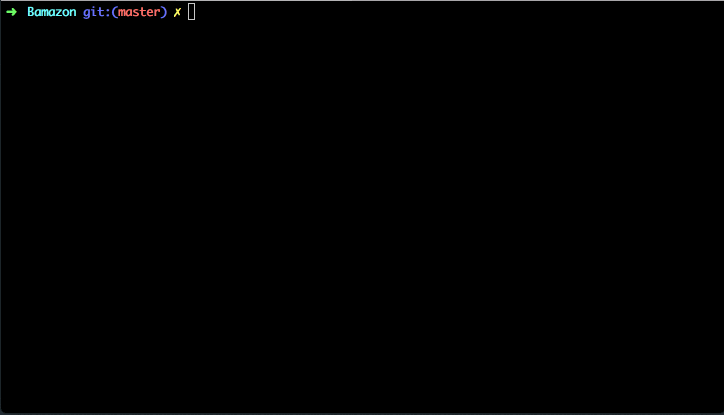

# Bamazon

## Table of Contents 

1. [Overview](#overview)
2. [Installation](#installation)
3. [Customer View](#customer)
4. [Manager View](#manager)
5. [Supervisor View](#supervisor)

<a name="overview"></a>
## Overview

Bamazon is a Node.js command line Amazon-like storefront app that utilizes MySQL to keep track of the store's available products and departments. It takes in orders from customers and depletes the stock from the store's inventory.

<a name="installation"></a>
## Installation

### Step 1: Git Clone

Clone Bamazon to your local git repo like the following:

```
git clone https://github.com/caseykwok/Bamazon.git
```

The Bamazon project and its files should now be in your project folder.

### Step 2: Install Dependencies

Install all modules listed as dependencies in `package.json` like the following:

```
npm install
```

The dependencies should now be in the local `node_modules` folder.

<a name="customer"></a>
## Customer View

1. Run the Node application called `bamazonCustomer.js` like the following:

	```
	node bamazonCustomer.js
	```

	Running the application will first display all the items available for sale. Each item will have the following information:

		- Item ID
		- Product Name
		- Department Name
		- Price
		- Stock Quantity

2. The application will prompt the customer with two messages. Customer should:

	- Enter the ID of the product they would like to buy.
	- Enter the number of units of the product they would like to buy.

3. Once the customer has placed an order, the application will check if the store has enough of the product to meet the customer's request.

	- If **yes**, the application will fulfill the customer's order and show the customer the total cost of their purchase.
	- If **no**, the application will inform the customer there is insufficient quantity and prevent the order from going through.

4. After the first round of successful or unsuccessful transaction, the application will ask whether the user wishes to continue shopping.



<a name="manager"></a>
## Manager View

1. Run the Node application called `bamazonManager.js` like the following:

	```
	node bamazonManager.js
	```

	Running the application will display the following list of menu options:

		- View Products for Sale
		- View Low Inventory
		- Add to Inventory
		- Add New Product
		- Exit

2. Selecting `View Products for Sale` will display all the items available for sale. Each item will have the following information:

	- Item ID
	- Product Name
	- Department Name
	- Price
	- Stock Quantity

3. Selecting `View Low Inventory` will display all the items with a stock quantity lower than 5.

4. Selecting `Add to Inventory` will prompt the manager with two messages. Manager should:

	- Enter the ID of the product they would like to restock.
	- Enter the number of units of the product they would like to restock.

5. Selecting `Add New Product` will prompt the manager with four messsages. Manager should:

	- Enter the name of the product they would like to add.
	- Select from the list of available departments that match closest to which the product belongs in. 
	- Enter the price per unit of the product they would like to add.
	- Enter the starting stock quantity of the product they would like to add.

	- Once the manager submits the product, the application will use the product name, department, and price per unit to determine if the product already exists in the inventory.

		- If **yes**, the application will inform the manager the product already exists. 
		- If **no**, the application will approve the manager's submission and show a summary of the product that has been added.

6. Selecting `Exit` will exit the application.


<a name="supervisor"></a>
## Supervisor View

1. Run the node application called `bamazonSupervisor.js` like the following:

	```
	node bamazonSupervisor.js
	```

	Running the application will display the following list of menu options:

		- View Product Sales by Department
		- Create New Department
		- Exit

2. Selecting `View Product Sales by Department` will display a summary of the highest-grossing departments in the store. Each department will have the following information:

	- Department ID
	- Department Name
	- Over Head Costs
	- Product Sales
	- Total Profit

3. Selecting `Create New Department` wll prompt the supervisor with two messages. Supervisor should:

	- Enter the name of the department they would like to create.
	- Enter the overhead cost of the department they would like to create.

4. Selecting `Exit` will exit the application.

